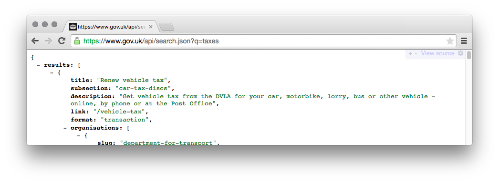

# Search API

**This was called "rummager", and to avoid messing up the `git blame`, there are still a lot of references to "rummager" (eg, filenames).  You can read "rummager" as "search-api".**

Search API indexes content into [elasticsearch](https://www.elastic.co/products/elasticsearch) and serves the GOV.UK search API.

## Live examples

### GOV.UK search
[alphagov/finder-frontend](https://github.com/alphagov/finder-frontend) uses
the search API to render [site search](https://www.gov.uk/search) and finder pages (such as [gov.uk/aaib-reports](https://www.gov.uk/aaib-reports)).

### The public search API
https://www.gov.uk/api/search.json?q=taxes

For the most up to date query syntax and API output see the [Search API documentation](https://docs.publishing.service.gov.uk/apis/search/search-api.html).

You can also find some examples in the blog post: ["Use the search API to get useful information about GOV.UK content"](https://gdsdata.blog.gov.uk/2016/05/26/use-the-search-api-to-get-useful-information-about-gov-uk-content/).

## Technical documentation

Search API is a Sinatra application that interfaces with Elasticsearch.

There are two ways documents get added to a search index:

1. HTTP requests to Search API's [Documents API](doc/documents.md) (deprecated)
2. Search API subscribes to RabbitMQ messages from the
	 [Publishing API](https://github.com/alphagov/publishing-api).

*Note: Once whitehall documents are using the new indexing process, the documents API will be removed and search API will consume only
from the publishing API.*

Search API search results are weighted by [popularity](doc/popularity.md). We
rebuild the index nightly to incorporate the latest analytics.

### Nomenclature

- **Link**: Either the base path for a content item, or an external link.
- **Document**: An elasticsearch document, something we can search for.
- **Document Type**: An [elasticsearch document
	type](https://www.elastic.co/guide/en/elasticsearch/guide/current/mapping.html)
	specifies the fields for a particular type of document. All our document
	types are defined in
	[config/schema/elasticsearch_types](config/schema/elasticsearch_types)
- **Index**: An [elasticsearch search
	index](https://www.elastic.co/blog/what-is-an-elasticsearch-index). Search API
	maintains several separate indices (`detailed`, `government` and `govuk`), 
	but searches return documents from all of them.
- **Index Group**: An alias in elasticsearch that points to one index at a
	time. This allows us to rebuild indexes without downtime.
  
### Dependencies

- [elasticsearch](https://github.com/elastic/elasticsearch) - "You Know, for Search...".
- [redis](https://github.com/redis/redis) - used by indexing workers.

### Creating search indexes from scratch
(This is not necessary when restoring from a backup or replicating data into the development VM)

To create an empty index:

    bundle exec rake search:create_index[<index_name>]

To create an empty index for all Search API indices:

    SEARCH_INDEX=all bundle exec rake search:create_all_indices

### Starting elasticsearch
If you're running the GDS development VM you need to have elasticsearch running before running the tests or starting the application.

Elasticsearch should start when you start up your dev VM, but if it doesn't, run:

	sudo service elasticsearch-development.development start

### Running the test suite

    bundle exec rake

### Running the application

If you're running the GDS development VM:

    cd /var/govuk/govuk-puppet/development-vm && bundle exec bowl search-api

Search API should then be available at
[search-api.dev.gov.uk](http://search-api.dev.gov.uk/search.json?q=taxes).

If you're not running the GDS development VM:

    ./startup.sh

#### Workers
Search API uses Sidekiq to manage its indexing workload. To run
this in the development VM, you need to run both of these commands:

    # to start the Sidekiq process
    bundle exec rake jobs:work

    # to start the search-api webapp
    bundle exec mr-sparkle --force-polling -- -p 3233

#### Publishing API integration
Search API subscribes to a RabbitMQ queue of updates from publishing-api. This still requires Sidekiq to be running.

		bundle exec rake message_queue:insert_data_into_govuk

There is also a separate process that listens to only 'links' updates from the publishing API. This is used for updating old indexes that are populated through the '/documents' API (`government`, `detailed`) and can be removed once those indexes no longer exist.

    bundle exec rake message_queue:listen_to_publishing_queue

### Evaluating search results
The `ab_tests` parameter can be used to distinguish between two versions of
the search query.

Using [search-performance-explorer](https://github.com/alphagov/search-performance-explorer),
you can compare the results side by side.

The [health check script](https://github.com/alphagov/search-performance-explorer/blob/master/health-check.md)
can be used to evaluate Search API using a set of judgments about which documents
are 'good' results for some sample queries.

### Changing the schema/Reindexing

After changing the schema, you'll need to recreate the index. This reindexes documents from the existing index.

    SEARCH_INDEX=all bundle exec rake search:migrate_schema

### Internal only APIs

There are some other APIs that are only exposed internally:

- [doc/content-api.md](doc/content-api.md) for the `/content/*` endpoint.
- [doc/documents.md](doc/documents.md) for the `*/documents/` endpoint.

These are used by [search admin](https://github.com/alphagov/search-admin/).

### Additional Docs

- [New indexing process](doc/new-indexing-process.md): how to update a format to use the new indexing process
- [Schemas](doc/schemas.md): how to work with schemas and the document types
- [Popularity information](doc/popularity.md): Search API uses Google Analytics
	data to improve search results.
- [Publishing advanced search](doc/advanced-search.md): Information about the advanced search finder
- [Publishing document finders](doc/publishing-finders.md): Information about publishing finders using rake tasks

## Licence

[MIT License](LICENCE.txt)
