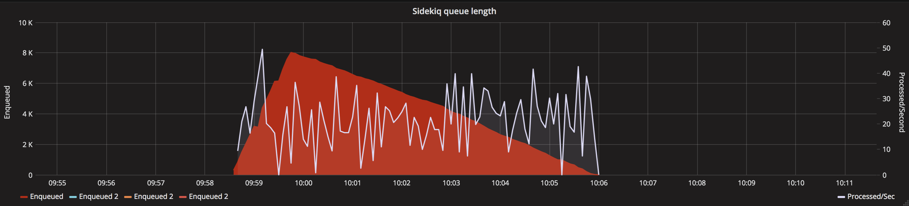
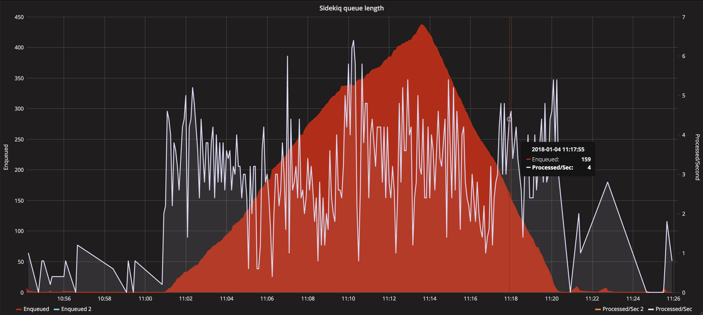
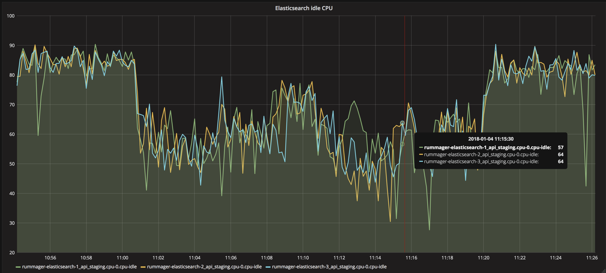

# Decision record: Batch processing of rabbit MQ messages

Date: 2018-01-05

## Definitions

ES refers to elasticsearch

## Context
As a result of [ADR 004](adr-004-transition-mainstream-to-publishing-api-index.md)
we now process data from rabbit MQ and insert them into our search index. While the 
process itself works as expected we have had scaling issues when large volumes 
of messages arrive from the publishing API and sit in our sidekiq queue waiting to be
processed.

There are two scenarios that result in large queue sizes:

1. Republishing from the publishing API - this is something we want to support moving 
forward as ultimately we would like the ability to rebuild the search index from scratch.
2. Changes to reference material (i.e. department name, taxons) which require all associated 
documents to be updated.

Currently, both of the above processes sends a message to rabbitMQ which is then sent 
to sidekiq before being processed into the ES index. The message currently 
consists of a single document to be updated in the search index.

We know that this causes a bottleneck with ES, as it performs balancing work 
after each insert, it is for this reason that the [ES documentation](https://www.elastic.co/guide/en/elasticsearch/reference/current/docs-bulk.html) recommends doing bulk
insertion of data rather than individual documents. 

We have have already implemented the following items to support batch processing:

* Handling of batches of messages in the Rummager processor. This requeues all messages if 
any of them fail during the ES update.
* Batching of messages as they are read off rabbit MQ by the [govuk_message_queue_consumer](https://github.com/alphagov/govuk_message_queue_consumer)

We have done some initial testing using the new batch processor and have the following results:

### Current process 

Processing 1 message at a time for approx 10000 documents (employment_tribunal_decision format)

### New process 

Processing 100 messages at a time with a 5 second timeout for approx 10000 documents (employment_tribunal_decision format)

### New process in bulk

Processing 100 messages at a time with a 5 second timeout for the top 4 formats - approx 125000 documents.

We don't see an increase in 500 error on dependant apps which means we aren't blocking
consumer applications as a result of increasing our throughput.

We do observed a number of SigTerm exceptions from the worker processes in Sentry
which was unexpected.
 
## Action plan

The following items need to be completed before this can be rolled out:

* Investigate the cause of the sentry SigTerm errors
* Test that documents are correctly republished - ideally by renaming the index, republishing and then comparing

## Consequences
- Processing in bulk will reduce the processing time to index documents
- This moves us step closer to being able to rebuild the search index on a regular basis, which would insure that it does
  not drift out of sync with the publishing api over time
