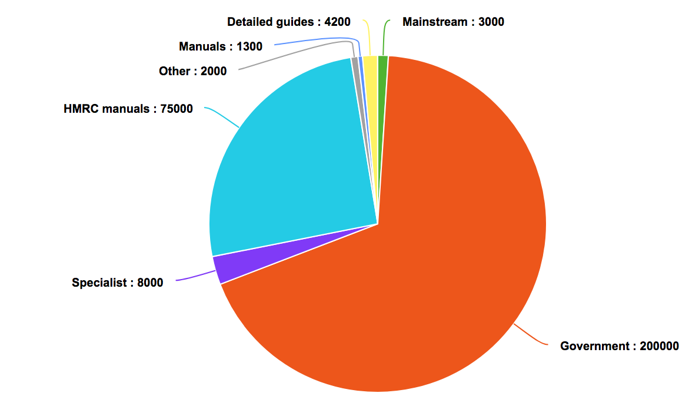

# Content in the search index and where it comes from

This list documents the kinds of things included in Rummager's search indexes,
and the apps currently responsible for publishing them as of June 2017.

For a broader view of the content that is available, see [Document types on GOV.UK](https://docs.publishing.service.gov.uk/document-types.html).

## Whitehall
This is what most publishers use to publish. Content appears on the ["inside government" part of GOV.UK](https://www.gov.uk/government/publications). There are 200,000 documents.

Implemented in [searchable.rb](https://github.com/alphagov/whitehall/blob/master/app/models/searchable.rb).

- 96460 publications
- 53678 news articles
- 11052 world location news articles
- 8112 speeches
- 4012 detailed guidance
- 3771 document collections
- 3766 consultations
- 3684 statistics announcements
- 2729 people
- 1579 case study
- 1109 corporate information pages
- 1017 organisations
- 677 policy groups
- 567 statistical data sets
- 501 fatality notices
- 455 worldwide organisations
- 318 ministers
- 234 world locations
- 63 topical events
- 47 “topics”
- 19 inside-government-links (DEPRECATED)
- 18 take parts
- 7 finders
- 5 operational fields

## Other publishing apps

Most publishing apps, such as publisher and specialist-publisher, do not send
content to Rummager directly. Instead, they publish content to the
[publishing-api][publishing_api] which adds the content to a notifications queue
to be ingested by rummager.

See [ADR 001][adr_001] for more details on this approach.

[publishing_api]: https://github.com/alphagov/publishing-api
[adr_001]: https://github.com/alphagov/rummager/blob/master/doc/arch/adr-001-use-of-both-rabbitmq-and-sidekiq-queues.md

## Search admin
Admin for GOV.UK search. Sends 506 "recommended links" to Rummager, so we can
show external links in search results.

Implemented in [elastic_search_recommended_link.rb](https://github.com/alphagov/search-admin/blob/master/app/models/elastic_search_recommended_link.rb).
