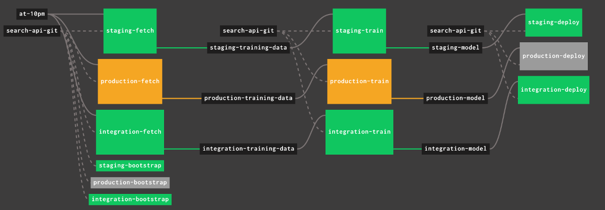

Learning to Rank
================

We are trying out using machine learning for improving ranking, using
the [TensorFlow Ranking][] module.  This doc covers how to use it and
what further work there is to do before we can trial this as an A/B
test.  ADR-010 covers the architectural decisions.

[TensorFlow Ranking]: https://github.com/tensorflow/ranking


Running it locally
------------------

### Set up

TensorFlow is written in Python 3, so you will need some libraries
installed.  The simplest way to do this is using `virtualenv`:

```sh
pip3 install virtualenv
virtualenv venv -p python3
source venv/bin/activate
pip install -r ltr/scripts/requirements.txt
```

This adjusts your shell's environment to use a local Python package
database in the `venv` directory.  If you close the shell, you can run
`source venv/bin/activate` again to bring everything back.


### Using LTR

**Set the `ENABLE_LTR` environment variable to "true", or all of this is disabled.**

There are several rake tasks for training and serving a TensorFlow
model in the `learn_to_rank` namespace.

The `learn_to_rank:generate_relevancy_judgements` task needs the
`GOOGLE_PRIVATE_KEY` and `GOOGLE_CLIENT_EMAIL` environment variables
set.  Values for these can be found in [govuk-secrets][].  The task is
run regularly and the generated `judgements.csv` file available in:

- `govuk-integration-search-relevancy`
- `govuk-staging-search-relevancy`
- `govuk-production-search-relevancy`

In the future we will store more things in these buckets, like the
trained models.

Assuming you have a `judgements.csv` file, you can generate a dataset
for training the model:

```sh
bundle exec rake learn_to_rank:generate_training_dataset[judgements.csv]
```

This task needs to be run with access to Elasticsearch.  If you're
using govuk-docker the full command will be:

```sh
govuk-docker run -e ENABLE_LTR=true search-api-lite bundle exec rake 'learn_to_rank:generate_training_dataset[judgements.csv]'
```

Once you have the training dataset you can train and serve a model:

```sh
bundle exec rake learn_to_rank:reranker:train
bundle exec rake learn_to_rank:reranker:serve
```

These tasks do not need access to Elasticsearch.

You now have a docker container running and responding to requests
inside the govuk-docker network at `reranker:8501`.  You can start
search-api with the `ENABLE_LTR` environment variable with:

```sh
govuk-docker run -e ENABLE_LTR=true search-api-app
```

If you now query search-api with `ab_tests=relevance:B` then results
will be re-ranked when you order by relevance.  If this doesn't
happen, check you're running search-api with `ENABLE_LTR` set.

The `learn_to_rank:reranker:evaluate` task can be used to compare
queries without needing to manually search for things.  It uses the
same `judgements.csv` file.

[govuk-secrets]: https://github.com/alphagov/govuk-secrets


Running it in production
------------------------

In production the model training and deployment are automated through
[Concourse][], with the deployed model hosted in [Amazon SageMaker][].
The Concourse pipeline is defined in `ltr/concourse/pipeline.yaml` and
hosted in [the RE-managed shared Concourse][].



The pipeline has three sets of jobs, one for each environment, which:

1. Call the `/ltr/train` endpoint in search-api to generate training
   data and upload it to S3.

2. Call Amazon SageMaker's training API to create a new model from
   that training data, and store the model artefact in S3.

3. Call Amazon SageMaker's deployment API to deploy the new model,
   removing the old model configuration (but leaving the artefact in
   S3).

Each "fetch" task is triggered automatically at 10pm.  If it
successfully completes, the "train" task is triggered.  If it
successfully completes, the "deploy" task is triggered.

All artefacts are stored in the relevancy S3 bucket: training data is
under `data/<timestamp>/` and model data under `model/<training
timestamp>-<timestamp>`.  Files are removed by a lifecycle policy
after 7 days.

[Concourse]: https://concourse-ci.org/
[Amazon SageMaker]: https://aws.amazon.com/sagemaker/
[the RE-managed shared Concourse]: https://cd.gds-reliability.engineering/teams/govuk-tools/pipelines/search-learn-to-rank

### New environment set up

There are some set-up tasks to be done before a new environment will
work with this Concourse and SageMaker configuration.

1. Deploy terraform, that's out-of-scope of this document, but the
   three essential bits are:

   - The `app-search` project
   - A domain name `search-api.<environment>.govuk.digital` (see
     `infra-public-services`)
   - A security rule allowing access from the Concourse IP addresses
     (see `infra-security-groups`)

2. Define jobs for the new environment in the `pipeline.yaml` file
   (copy one of the current environments and just change the name).

3. Deploy the Concourse configuration (with `fly set-pipeline`).

4. Set the Concourse secrets (the `((...))` bits of the pipeline) for
   the environment with `gds-cli`.

5. Run the `<environment>-bootstrap` Concourse job.

6. Run the `ltr/scripts/build-ecr.sh <ecr repo>` script.  The ECR
   repository is given in the output of deploying the `app-search`
   terraform.

### Training and deploying a second model for A/B testing

**You will need to be an AWS Power User and also have access to
Concourse to follow these steps.**

You can add new train and deploy jobs to the pipeline to facilitate
A/B testing.  This is useful if you want to try out new features or
configurations without switching over 100%.

At the end of this process you will have a second SageMaker endpoint
running serving your new model, and a Concourse job you can trigger to
train and deploy a new model.  You will be able to supply training
data to SageMaker by putting the SVM files in a designated S3
location.

**If you need a custom training image,** which will be the case if
you've edited any of the files in `ltr/scripts`, then you can build it
with the `ltr/scripts/build-ecr.sh` script.

Run these commands locally:

```
# first assume-role into AWS (using gds-cli or however you do it)
cd ltr/scripts
./build-ecr.sh <ecr repo> <tag name>
```

You can get the `<ecr repo>` from the AWS console.

The `<tag name>` is how you will identify the image in SageMaker.
The daily model is trained using the `latest` tag, so don't use that.

**If you need custom training data,** for example you've added or
removed a feature, generate the data and put it in S3 at
`s3://govuk-<environment>-search-relevancy/data/<key name>/{train,test,validate}.txt`.
The `<key name>` can be anything, and will be incorporated into the model
name.

How you generate the data will depend on what changes you have made.

**Add a training and deployment step for your model to the pipeline,**
your user role does not have the necessary permissions to invoke
SageMaker directly, so you have to use Concourse to do that.
Additionally, this lets you train and deploy new versions of the model
at the click of a button.

The below YAML snippets are examples of what you would add to
`ltr/concourse/pipeline.yaml`.

1. Decide on a name.

    *In the YAML snippets below I've gone for `AB-SOMETHING`.*

2. Add a new entry to the `resources:` list:

    *In this and the YAML snippets below I'm only doing integration.*

    ```yaml
    - name: integration-AB-SOMETHING-model
      type: s3-iam
      source:
        bucket: ((readonly_private_bucket_name))
        region_name: eu-west-2
        regexp: search-learn-to-rank/integration-AB-SOMETHING-model-(.*).txt
    ```

3. Add a new training job to the `jobs:` list:

    *If you're not using custom training data, instead use the output
    of the normal fetch job here.*

    ```yaml
    - name: integration-AB-SOMETHINGtrain
      plan:
        # delete "get: integration-training-data" step
        - get: search-api-git
        - task: Train
          config:
            <<: *task-config
            inputs:
              # delete "name: integration-training-data" input
              - name: search-api-git
            outputs:
              - name: out
            params:
              # delete "INPUT_FILE_NAME: training-data" param
              GOVUK_ENVIRONMENT: integration
              IMAGE: ((integration-ecr-repository))
              ROLE_ARN: ((integration-role-arn))
              OUTPUT_FILE_NAME: AB-SOMETHING-model
              # add "IMAGE_TAG: <tag name>" param, with the appropriate <tag name>
              IMAGE_TAG: "<tag name>"
              # add "SCRIPT_INPUT_DATA: <key name>" param, with the appropriate <key name>
              SCRIPT_INPUT_DATA: "<key name>"
            run:
              path: bash
              args: ["search-api-git/ltr/concourse/task.sh", "train"]
          on_failure:
            <<: *notify-failure
        - put: integration-AB-SOMETHING-model
          params:
            file: out/integration-AB-SOMETHING-model-*.txt
    ```

4. Add a new deployment job to the `jobs:` list:

    ```yaml
    - name: integration-AB-SOMETHING-deploy
      plan:
        - get: integration-AB-SOMETHING-model
          passed: [integration-train]
          trigger: true
        - get: search-api-git
        - task: Deploy
          config:
            <<: *task-config
            inputs:
              - name: search-api-git
              - name: integration-AB-SOMETHING-model
            params:
              GOVUK_ENVIRONMENT: integration
              ROLE_ARN: ((integration-role-arn))
              INPUT_FILE_NAME: AB-SOMETHING-model
              # add "ENDPOINT_NAME: govuk-integration-AB-SOMETHING-search-ltr-endpoint"
              ENDPOINT_NAME: govuk-integration-AB-SOMETHING-search-ltr-endpoint
            run:
              path: bash
              args: ["search-api-git/ltr/concourse/task.sh", "deploy"]
          on_failure:
            <<: *notify-failure
    ```

**Deploy your pipeline with `fly`,** if you've not logged into
Concourse before, download `fly` from
https://cd.gds-reliability.engineering/ (see the list of operating
systems in the bottom right) and log in:

```bash
fly login -t cd-govuk-tools -n govuk-tools -c https://cd.gds-reliability.engineering
```

Then deploy the pipeline:

```bash
fly set-pipeline -t cd-govuk-tools -p search-learn-to-rank -c ltr/concourse/pipeline.yaml
```

**Trigger a build of the "train" job,** which will train a new model
and upload it to S3.  When the train job completes it will trigger the
deploy job, which will create your new SageMaker endpoint and start
serving the model.

Reranking
---------

Reranking happens when `ENABLE_LTR=true` is set.  The model is found
by trying these options in order, going for the first one which
succeeds:

1. If `TENSORFLOW_SAGEMAKER_ENDPOINT` is set, [Amazon SageMaker][] is
   used.  It's assumed that search-api is running under a role which
   has permissions to invoke the endpoint.

2. If `TENSORFLOW_SERVING_IP` is set, `http:://<ip>::8501` is used.

3. If `RANK_ENV` is `development`, `http://reranker:8501` is used.

4. `http://0.0.0.0:8501` is used.

When reranking is working, search-api results get three additional
fields:

- `model_score`: the score assigned by TensorFlow
- `combined_score`: the score used for the final ranking
- `original_rank`: how Elasticsearch ranked the result

We may remove `combined_score` in the future, as it's just the same as
`model_score`.


To do
-----

Here are problems to solve before we could turn this into an A/B test:

- Generate relevancy judgements from user data
- Investigate which features work best for modelling
- Investigate which TensorFlow settings work best for  modelling
- Investigate window sizes for reranking
- Measure the performance impact
- Handle errors in the reranker (eg, unavailability)
- Add monitoring and alerting
- Think about ways in which a black-box model could be abused and how we can debug issues
