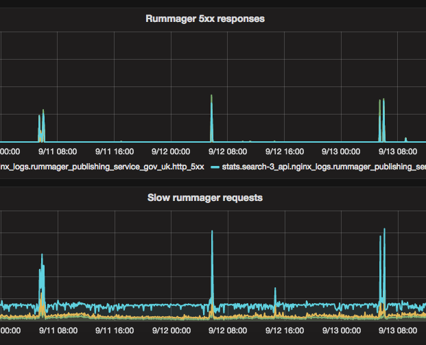
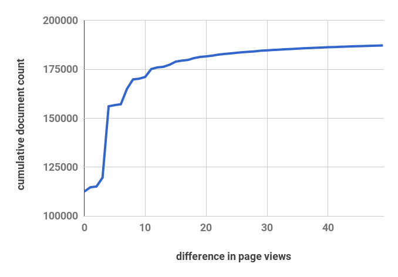

# Decision record: Incremental popularity updates

Date: 2017-09-15

## Status

Rejected.

## Context

In [ADR 003 - perform popularity updating without using an index lock](docs/arch/adr-003-popularity-updating-without-index-locks.md) we changed the process
for bulk loading data into Rummager's search indexes to update the existing index in place, rather than creating a separate index, which had required locking the existing index until the new one was ready. The main reason we bulk load
data is to update the popularity field every night, which affects every document in the search index.

## Problem

After switching to the new index, we observed regular spikes in 503 errors from the search API, that coincide with when the nightly task runs. The elasticsearch queries were taking longer than normal and timing out.

We want reads from the index to be unaffected by bulk indexing, because the user's ability to search is more important than the content being up to date.

As part of the investigation, we looked at ways we could change the
implementation of the nightly popularity update to improve performance. We
considered limiting the popularity update task so that it only changed a small
number of documents every night.

## Decision

We decided against making any technical changes to the popularity update process
now. Instead we reduced the number of sidekiq processes that index into
elasticsearch at the same time, which reduced the impact on search performance,
without making any noticeable difference to the indexing time.

## What we learned

The `page-traffic` index contains today's analytics data, and is updated nightly. The number of page views a link has over a 14 day period is stored in its `vc_14` field, and the rank relative to other pages on GOV.UK is stored in the `rank_14` field.

We compared the `vc_14` field in the page traffic
over two successive days to work out how much page popularity shifts in practice.

A very small number number of pages actually have significant changes day to day
(i.e, a change of at least +/- 10 page views). This means that we shouldn't need
to update the entire search index every day - we could get away with 10% of the current update workload.

Despite this, we don't think that incremental popularity updates would work
without significant changes.

Rummager doesn't use the `vc_14` values directly to order search results; it uses `rank_14` (the relative ranking compared to all pages in the index).

The `rank_14` value changes a lot more day to day than `vc_14`, since small differences in page views of a single document can shift a lot of other documents up and down. We're not confident that if we only update the 10% of content whose rank has changed the most, we could keep rummager's data reflecting the actual distribution of pageviews.

When we update the popularity field in the search indexes, we derive it from the `rank_14` value in `page-traffic`. This means that at update time, the data we actually have available to compare is the previous day's popularity and the current popularity (derived from rank).

We considered also storing `vc_14` in the search index, but retaining `popularity` as well. We could then see if the change in `vc_14` meets a threshold before updating popularity. We rejected this too, because it means that when a document becomes more popular, we would still neglect to update the rank of documents it overtakes. Also, for documents that aren't viewed often, we would introduce a bias towards older content, because the the rank a new document starts with when it has no pageviews is equal to the current size of the index, and the popularity is derived from this.

It may be better to change rummager to use `vc_14` directly for its popularity boost, which would let us do partial popularity updates. This is a bigger change than we want to make right now, as it would need careful measurement to ensure we don't break queries.

## Consequences
Running the popularity update still has some impact on the search response time.

We still have the ability to bulk load into an empty index if we need to (using the `migrate_schema` rake task).

Our cluster isn't tuned optimally for [bulk-indexing performance](https://www.elastic.co/guide/en/elasticsearch/guide/current/indexing-performance.html). We experimented with some of the settings that affect indexing performance to see if it helped reduce the impact on search performance, but since none of the changes affected this we left the configuration as it was.
